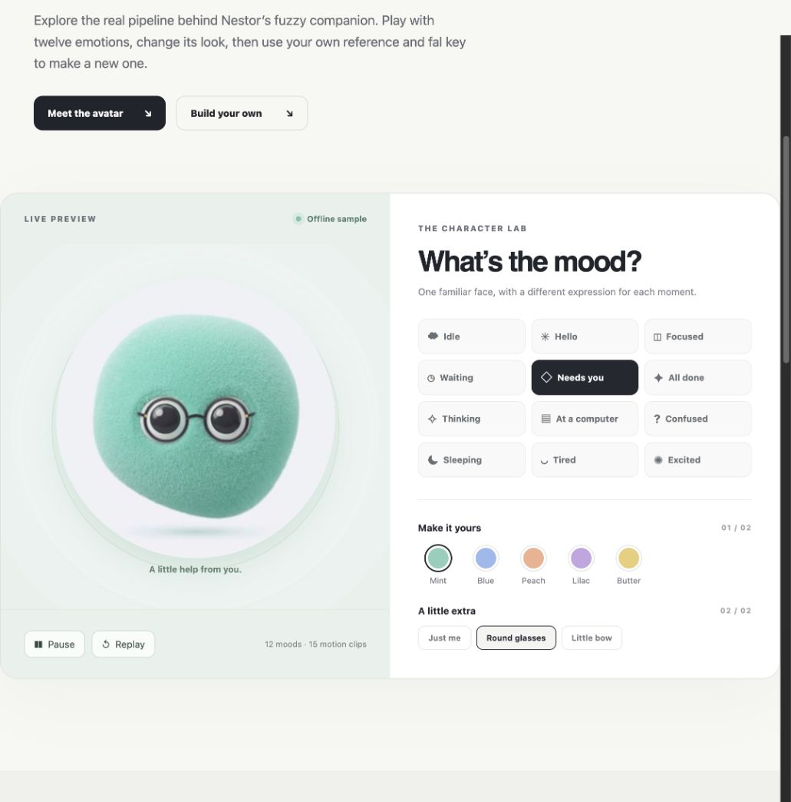

# Live Avatars

A working playground and technical recipe for building a cute, consistent animated character from one reference image. The included Nestor example has **12 expressions, 15 short motion clips, five live colors, and two accessories**. Try every state without an API key; bring your own [fal.ai](https://fal.ai) key to generate a new portrait or animation locally.

The visual direction was inspired by [ChatGPT dots](https://help.openai.com/en/articles/20001530-getting-started-with-your-dot), [Grok Bot's expressive avatars](https://x.ai/news/designing-grok-bot), and [Meta Muse](https://research.meta.ai/blog/bringing-your-muse-to-life). This repository explains Nestor's independently built character and pipeline; it contains no assets or implementation from those products.



## Run it

Requires Node.js 20 or newer. No install step or frontend build is needed.

```bash
git clone https://github.com/obaid/live-avatars.git
cd live-avatars
npm start
```

Open **http://127.0.0.1:4175**. The server binds only to loopback. Select a mood, color, and accessory to play with the bundled sample. To make your own, upload an image you own or have permission to edit, enter a fal key, adjust the prompt, and choose one generation step:

1. **Identity-preserving master** → Nano Banana 2 image edit.
2. **Expression still** → Nano Banana 2 image edit from your current portrait.
3. **Motion clip** → H3 Max Turbo image-to-video with the same image as first and last frame.

Generation uses your fal account and can incur charges. A single click submits one request; wait for its queue result before trying again. If a submission times out, check your fal request history before resubmitting so you don't pay for a duplicate. The sample player needs no key and makes no fal calls.

## How it works

```text
reference image → Nano Banana 2 master → expression stills
                                      ↓
                                H3 Max Turbo loops
                                      ↓
                   offline video + Canvas tint + SVG accessories
```

`src/server.mjs` is a small local proxy for fal's async queue. It accepts a reference image as a data URI, sends requests to only two fixed model endpoints, polls the returned queue URLs, and serves completed media from an ignored `generated/` directory. `src/queue.mjs` validates models, input, and provider URLs. `public/app.js` plays one motion clip at a time and draws it into Canvas. `src/appearance.mjs` recolors only the mint fur pixels while keeping their lightness and texture; it estimates eye and body anchors for the glasses and bow.

The key is held only in the browser tab's memory and passed in a request header to the local proxy. It is not placed in a URL, localStorage, generated media, logs, Git history, or the bundled app. Alternatively, set `FAL_KEY` in your shell for this local process. **Do not expose port 4175 publicly**; the proxy is intentionally scoped to a developer's own machine. A hosted multi-user version would need authentication, abuse controls, explicit HTTPS handling, and a separate key-management design.

Generated H3 clips are videos with baked backgrounds—not a real-time 3D rig. For the original Nestor app, we encoded 320×320 H.264 at 24 fps with no audio and embedded the clips and posters in an offline React Native WebView player. This repository shows the same architecture in a simpler web player. The twelve state samples and 15 clips are about 1.2 MB together. [Read the full technical walkthrough](docs/how-we-made-cute-avatars.md).

## Reproduce the pipeline

The actual prompt structure is in [`docs/prompts.md`](docs/prompts.md). Start with a distinctive reference image. Generate one master and inspect it before creating state portraits. Keep silhouette, eye geometry, framing, backdrop, and material constraints in every prompt. Animate the states with restrained motion and matching start/end frames. Review the first, middle, and last frames of each clip for changed eyes, props, or silhouette. Some takes will fail visually even when the API succeeds; regenerate only those states.

The sample reproduces the final player and appearance layer. The live generation form intentionally submits one step at a time so each output can be inspected before it becomes the next reference. It does not silently produce a full 12-state pack, which would trigger many paid jobs.

## Repo map

- `public/` — responsive playground and bundled sample media
- `src/appearance.mjs` — shared tint and accessory placement functions from Nestor
- `src/queue.mjs`, `src/server.mjs` — local fal queue proxy
- `docs/how-we-made-cute-avatars.md` — article ready for publication
- `docs/prompts.md` — editable identity, expression, fuzz, and motion prompt templates
- `docs/social-posts.md` — X and LinkedIn launch copy
- `docs/x-article.md`, `docs/linkedin-article.md` — full-length platform article drafts
- `tests/` — input, URL, queue, proxy, and key-leak checks using mock fal responses

## Source and rights

The code is MIT licensed. Nestor's sample images, videos, name, and character design are included for demonstration and remain © Obaid Ahmed; they are **not** covered by the MIT license. Make your own character from a reference you can use. This project is an independent example and is not affiliated with fal.ai, Google, or MiniMax.

Model documentation: [Nano Banana 2 edit](https://fal.ai/models/fal-ai/nano-banana-2/edit/api) · [H3 Max Turbo image-to-video](https://fal.ai/models/minimax/h3-max-turbo/image-to-video/api) · [fal queue](https://fal.ai/docs/documentation/model-apis/inference/queue).
